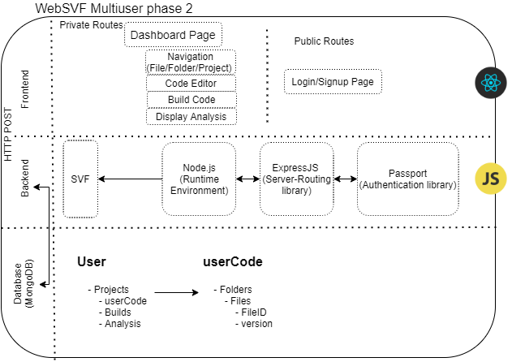

# **WebSVF 2.0**

## **WebSVF 2.0 Framework Techstack**

- **Frontend**: ReactJS
- **Backend**: Express JS
- **Database**: MongoDB

## **App Architecture**

## **Pre-requisite**

- Ubuntu 18.04
- Node JS 10.x or higher --> ([Update Nodejs in Ubuntu 18.04 to higher than 10.x](https://linuxize.com/post/how-to-install-node-js-on-ubuntu-18.04/))
- Yarn (preferred) OR NPM

## **Initial Setup**

### **For `/analysis` routes**

- The `/analysis` routes work using SVF.
- Ubuntu 18.04 is recommended for optimal use.
- To setup LLVM, Clang and SVF run the following command to install them using [WebSVF-backend](https://www.npmjs.com/package/@websvf/create-analysis):
  - `sudo npx @websvf/create-analysis --install-all`

### **For Developers:**

- An individual mongo atlas account needs to be set up as well in order to run the app with backend. For this:
  - Navigate to /WebSVF2-0/config/
  - create a `creds.js` file and add the details. For template, refer to `creds_sample.js`

## **Starting the App**

- Navigate to /WebSVF2-0/
- run `yarn` to initialise the app
- To start the app run `yarn start`
- To start the app in development mode `yarn dev`
- Both `yarn start` and `yarn dev` will automatically start the frontend client as well, on port `3000`
- Currently runs on PORT as defined in the .env file or `5001`. If PORT isn't defined in .env, the server is accessible locally at http://localhost:5001
