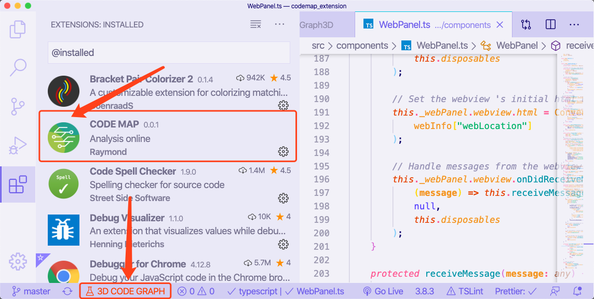

# WebSVF

## **Index**

1. **[Architecture Overview](#architecture-overview)**
1. **[Description](#description)**
1. **[Installation Guide](#installation-guide)**
1. **[Known Issues](#known-issues)**
1. **[Developer Notes](#developer-notes)**
1. **[Acknowledgement](#acknowledgement)**

# Architecture Overview


# Description

The Web-SVF, Bug Analysis Tool is comprised of 4 main components:

- **[WebSVF-frontend-server](/src/WebSVF-frontend-server) :**

NodeJS based Web-Server that is responsible for Front-End output of the *Bug Analysis* Tool. Please refer to the **[WebSVF-frontend-extension](https://github.com/SVF-tools/WebSVF/tree/master/src/WebSVF-frontend-extension)** for instructions regarding its deployment. It is deployed automatically by the **Bug Analysis VSCode Extension**.

- **[WebSVF-frontend-extension](/src/WebSVF-frontend-extension) :**

This VSCode Extension serves as a wrapper for the NodeJS based Front-End for the *Bug Analysis* tool, **[WebSVF-frontend-server](https://github.com/SVF-tools/WebSVF/tree/master/src/WebSVF-frontend-server)**. It is deployed through the installation of the ***[WebSVF-frontend-extension_0.9.0.vsix](https://github.com/SVF-tools/WebSVF/releases/download/0.9.0/WebSVF-frontend-extension_0.9.0.vsix)*** file on *[VSCode locally](https://code.visualstudio.com/download)* or in *[code-server](https://github.com/cdr/code-server)* deployed online.

- **[WebSVF-codemap-extension](/src/codemap_extension/) :**

This VSCode Extension could use 3D force graph to present bug information. Vsix file need to create by user self. Please follow the user guide link to install. This extension needs to be used when there is a network.

- **[WebSVF-backend](https://github.com/SVF-tools/WebSVF/tree/generateJSON/src/WebSVF-generateJSON) :**


# Installation Guide

## Pre-Requisites

- WebSVF only tested and targetted for **Ubuntu 20.04** (Not compatible with versions of Ubuntu older than 19.10) 

## Step 1. Install NPM (v>=10.0.0)

On an Ubuntu 20.04 Installation, simply open terminal and enter the following commads:

### Refresh Ubuntu Repositories

```
sudo apt-get update
```

### Install NPM

```
sudo apt install -y npm
```

## Step 2. Install and Run ***WebSVF-backend***

### 1. Install WebSVF Extensions and Dependencies (SVF, LLVM, Clang...)

```
sudo create-analysis -i [-u user]
```

#### **`-i`** or **`--install`** :

To install WebSVF and all its dependencies

#### **`-u user`** or **`--user user`**: 

Where the `--user` flag indicates that a String is being provided which is the `user` for which WebSVF should be installed. If the user is not specified with the `--user` flag then the user is prompted with a list of users to select from.

### 2. Generate Analysis for LLVM Bitcode (.bc) file

Generate the bitcode file for your program or project then run the following command from the same directory as the .bc file or specify the directory of the .bc file.

```
create-analysis -g [bc-file-directory]
```

  
## Step 3. Run WebSVF-frontend: server and extension

### **Guide Video (Youtube)**

[](https://www.youtube.com/watch?v=--a1rgFE_Cs)

### Intructions:  

- **Open Project Folder in VSCode**

    Download and copy the [``Bug-Analysis-Report.json``](https://github.com/SVF-tools/WebSVF/releases/download/0.9.0/Bug-Analysis-Report.json) file in the current folder opened in your VSCode application window.

- **Initialise the '*WebSVF-frontend*' VSCode Extension**

    Install WebSVF-frontend-server by clicking on the ***'Bug Analysis Tool' button*** in the bottom left corner of your VSCode             application window (provided by the '*WebSVF-frontend*' VSCode Extension). Wait till the button reads: ***'Bug Analysis Tool:           Initialized'***

- **View the Bug Analysis for the Project**

    View the Bug Analysis for the Project by clicking on the ***'Bug Analysis Tool: Initialized' button***. The button text will turn red and the button will read ***'Bug Analysis Tool: Running'***. 
    (Please refer to the [Extension's Operation Guide](/src/WebSVF-frontend-extension/README.md#Extension-Operation-Guide) for more          information)

## Step 4. Run WebSVF-codemap-extension

- **Installed situation**  
  

  After 30 seconds installation, you can see the 3D CODE MAP logo at below left.
- **Follow [User Instructions](./src/codemap_extension/README.md)**  
  
  
  Please follow the User Instruction to use it.


# Known Issues

- **3D-CodeMap Components not compatible with OS:** Please note that certain legacy components were developed specifically for ***Ubuntu 19.10 or 20.04***. If the component of Web-SVF you want to work with is not compatible with your OS please refer to [this guide](https://github.com/SVF-tools/WebSVF/blob/master/docs/Install_VirtualBox.md) for assistance setting up a Virtual Machine. 

- **Repository Website:** If  https://svf-tools.github.io/WebSVF/  displays a blank page, please find an error icon in the address bar of your browser and click on it. An error window will pop out saying 'Insecure Content Blocked' since page security is not implemented yet, click on 'Load unsafe Scripts' to load the webpage.

# Developer Notes

## Patch Notes

Please find the CHANGELOG **[here](https://github.com/SVF-tools/WebSVF/blob/master/CHANGELOG.md)**

# Acknowledgement

WebSVF would not have been possible without its comprising tools and the individual contributions of all its collaborators. 
Links to the individual repositories for all contituent components are listed below along with their configuration in the offline-install in this repository.

- **[SVF](https://github.com/SVF-tools/SVF) :**

SVF is a static tool that enables scalable and precise interprocedural dependence analysis for C and C++ programs. SVF allows value-flow construction and pointer analysis to be performed iteratively, thereby providing increasingly improved precision for both.
